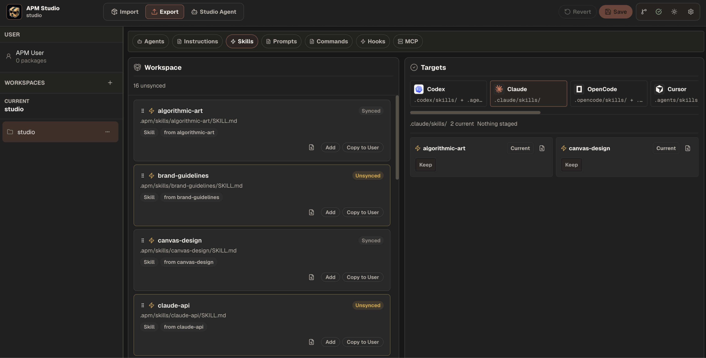

# APM Studio

**Package Studio Agents, instructions, MCP, skills, and Studio runtime models once, then manage target sync for Codex, Claude, and APM-compatible assistant files.**

[](https://www.npmjs.com/package/apm-studio)

[](./LICENSE)

[Quick Start](#quick-start) | [Why APM Studio](#why-apm-studio) | [Concepts](#concepts) | [CLI](#cli) | [Development](#development)



APM Studio is a local workspace for importing reusable coding-agent packages, editing/running Studio Agents, and managing external assistant target sync. It gives you a visual canvas for composing instructions, skills, MCP requirements, Studio Agent model settings, and multi-agent workflows, then projects selected units into the assistant target you choose.

The core idea is simple: build an APM-style agent package, keep it versionable and inspectable, and sync it into the coding assistants you already use.

## Quick Start

Requirements:

- Node.js `>=20.19.0`
- macOS, Linux, Windows, or WSL
- OpenCode for local runtime execution

```bash
npm install -g apm-studio
apm-studio /path/to/project
```

From source:

```bash
npm install
npm run dev
```

## Why APM Studio

AI coding assistants are powerful, but their reusable behavior often ends up scattered across prompts, skill folders, project docs, model settings, and app-specific config. APM Studio turns those pieces into APM-backed packages you can import, edit/run as Studio Agents, and sync into target assistants.

| Capability | What it gives you |
| --- | --- |
| Studio Agents | Compose instructions, skills, MCP requirements, and Studio runtime model settings as reusable agents. |
| Visual editing | Arrange agents and team workflows on a local canvas. |
| Manage targets | Export Studio Agents or sync APM primitives to external coding assistants through a CLI-first target pipeline with Studio fallback where supported. |
| Runtime chat | Test standalone agents and multi-agent workflows through the local runtime. |
| APM-first state | Keep canonical package state in `packages/<packageId>/apm.yml` plus the package `.apm/` source tree while `.apm-studio/` stores Studio UI metadata, drafts, and cache. |
| Import, Studio Agent, Manage | Import source-reference presets, edit and run agents/teams in Studio, then manage selected target sync. |
| GitHub-backed registry | Preview and import community repos as APM packages without copying package content into the registry. |

## Concepts

| Concept | Role |
| --- | --- |
| Instruction | The always-on instruction layer for an agent. |
| Skill | A reusable capability bundle, usually backed by `SKILL.md`. |
| Studio Agent | A runnable agent built from instruction, MCP, skills, and a Studio-only model setting. |
| Team Workflow | A multi-agent workflow with participants, relationships, and collaboration rules. |
| Manage | A target-sync mode for exporting Studio Agents and syncing APM agents, instructions, skills, and MCP configuration to external assistant apps. |

```text
Instruction + MCP + Skills + Studio runtime model = Studio Agent
Studio Agents + rules = Team Workflow
GitHub repo -> APM Studio -> APM CLI-first target sync -> assistant app
```

The community registry lives in the sibling `apm-registry` Worker project. It stores GitHub source references, import recipes, target compatibility, trust metadata, presets, and anonymous download counts; package content remains in source repositories and local APM manifests.

## CLI

```bash
apm-studio [path] [options]
apm-studio open [path] [options]
apm-studio doctor [path] [options]
apm-studio --help
apm-studio --version
```

Examples:

```bash
apm-studio
apm-studio ~/projects/my-app
apm-studio open . --no-open
apm-studio open . --port 43111
apm-studio doctor
```

Behavior:

- `apm-studio` opens the current directory as a workspace.
- `apm-studio <path>` opens that directory as a workspace.
- `apm-studio doctor` checks Node.js, workspace path, ports, and OpenCode readiness.

## Managed Runtime

APM Studio starts and owns its OpenCode sidecar automatically. App-owned config lives under `~/.apm-studio/opencode`.

Default local ports:

| Runtime piece | Port |
| --- | ---: |
| Published CLI app and API | `43100` |
| Published CLI managed OpenCode sidecar | `43102` |
| Dev client | `43200` |
| Dev API | `43201` |
| Dev managed OpenCode sidecar | `43202` |

## Development

```bash
npm install
npm run dev
npm run type-check
npm test
```

Important directories:

- `src/`: browser UI and workspace state.
- `shared/`: client/server contracts for packages, runtime, workspace state, and target sync.
- `server/`: API routes, Import behavior, target sync, runtime preparation, and projections.
- `.opencode/`: generated runtime artifacts.
- `doc/`: behavior and boundary guides.

Local APM package content lives under `packages/*`; generated runtime output and assistant target files are not source of truth.
