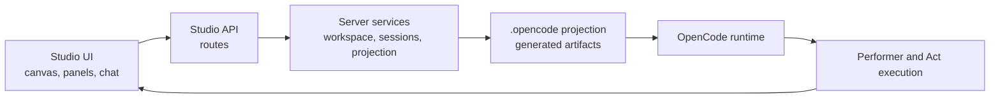

# DOT Studio

**A local visual workspace for choreographing AI performers and Acts on top of OpenCode.**

[](https://www.npmjs.com/package/dot-studio)

[](./LICENSE)

[Quick Start](#quick-start) | [Why Studio](#why-studio) | [How It Works](#how-it-works) | [Core Concepts](#core-concepts) | [CLI](#cli) | [Development](#development)


DOT Studio is the local visual editor for [Dance of Tal](https://github.com/dance-of-tal/dance-of-tal). It gives agent builders a Figma-style canvas for arranging Tal, Dances, Performers, and Acts, then projects that authoring state into OpenCode-ready runtime artifacts.

Use it when you want to sketch, inspect, run, and revise an AI workflow without turning the whole process into config-file archaeology.

## Quick Start

### Install

Requirements:

- Node.js `>=20.19.0`
- macOS, Linux, Windows, or WSL
- An environment supported by [OpenCode](https://github.com/opencode-ai/opencode)

```bash
npm install -g dot-studio
dot-studio /path/to/project
```

If the target directory has not been initialized as a DOT workspace, Studio prepares it automatically and opens the browser UI.

### Run From Source

```bash
npm install
npm run dev
```

The dev stack starts:

| Service | Port |
| --- | ---: |
| Studio client | `43200` |
| Studio API | `43201` |
| Managed OpenCode sidecar | `43202` |

The published CLI uses port `43100` by default, keeps its managed OpenCode sidecar on `43102`, and scans upward when the app port is busy unless you pass `--port`.

## Why Studio

AI systems get hard to reason about when identity, skills, tools, memory, and collaboration rules all live in separate files. Studio brings those pieces into one local workspace.

| Capability | What it gives you |
| --- | --- |
| Visual composition | Drag, drop, connect, and inspect performers and Acts on a canvas. |
| Assisted editing | Ask the Studio Assistant to scaffold or update Tal, Dances, Performers, and Acts. |
| Runtime chat | Talk to standalone performers, Act participants, and the Studio Assistant in one UI. |
| Local-first state | Keep workspace state local while Studio prepares OpenCode runtime output. |
| OpenCode projection | Convert Studio concepts into `.opencode/agents/dot-studio/...` artifacts for execution. |
| MCP-aware setup | Configure models, MCP servers, and runtime settings from the same workspace. |

## How It Works



Studio keeps authoring and runtime responsibilities separate:

- `src/` renders and edits Studio state in the browser.
- `shared/` defines client/server contracts.
- `server/` turns Studio state into API responses, sessions, projections, and runtime actions.
- `.opencode/` contains generated OpenCode-facing artifacts.
- OpenCode executes the projected runtime outside the React app.

> [!IMPORTANT]
> `.opencode/` is generated output for OpenCode. Treat Studio state and source files as the source of truth unless you are explicitly debugging projection output.

## Core Concepts

| Concept | Role |
| --- | --- |
| `Tal` | Identity, instruction, and behavior layer. |
| `Dance` | Reusable skill or capability package. |
| `Performer` | Runnable agent composed from Tal, Dances, model settings, and MCP config. |
| `Act` | Multi-performer choreography with collaboration rules and wake-up behavior. |

The shortest mental model:

```text
Tal + Dance + model + tools = Performer
Performers + relationships + rules = Act
```

## Acts

An Act is the coordination layer for a group of performers. It defines how work moves between participants at runtime.

An Act usually contains:

- `participants`: performers that take part in the Act
- `relations`: links that describe who can coordinate with whom
- `actRules`: shared choreography rules for the whole Act
- `subscriptions`: optional wake-up signals such as teammate messages, board keys, tags, or runtime events

Typical loop:

1. Attach performers as participants.
2. Define participant relationships and shared rules.
3. Let Studio project the authoring state into a runtime Act definition.
4. Run the Act while participants message teammates, update shared board state, and wake on relevant signals.

The canvas version of an Act is the choreography specification. Runtime thread state is execution history, not the canonical Act asset.

## Workflow

### 1. Open a Workspace

```bash
dot-studio /path/to/project
```

Studio restores saved state for that directory when available. A fresh directory opens as a new workspace instead of silently jumping to another recent project.

### 2. Create or Import Assets

Start from the canvas or ask the Studio Assistant to help:

- create a Tal draft
- create a Dance draft
- import an installed Performer or Act
- drag Performers and Acts onto the canvas

### 3. Configure a Performer

Each performer can combine:

- a Tal
- one or more Dances
- a model and variant
- MCP servers and runtime configuration

### 4. Build an Act

Acts connect performers into a runtime collaboration:

- attach performers as participants
- define participant relationships
- set collaboration rules
- chat with participants in runtime threads

### 5. Chat and Iterate

Use Studio to send prompts, inspect responses, review available tools, and keep editing the workspace between runs.

> [!NOTE]
> Runtime-affecting edits are picked up on the next execution path. Studio handles projection and runtime refresh for you.

## CLI

```bash
dot-studio [path] [options]
dot-studio open [path] [options]
dot-studio doctor [path] [options]
dot-studio --help
dot-studio --version
```

Examples:

```bash
dot-studio
dot-studio --openai-oauth
dot-studio ~/projects/dance-of-tal
dot-studio --openai-oauth --act act/@acme/workflows/review-flow
dot-studio ~/projects/dance-of-tal --performer performer/@acme/workflows/reviewer
dot-studio open . --no-open
dot-studio open . --act act/@acme/workflows/review-flow
dot-studio open . --port 43111
dot-studio doctor
dot-studio doctor ~/projects/dance-of-tal
```

Behavior:

- `dot-studio` opens the current directory as a workspace.
- `dot-studio <path>` opens that directory as a workspace.
- `--openai-oauth` connects OpenAI through browser OAuth before the Studio browser opens. It can be combined with `--performer` or `--act`.
- `--performer <urn>` prepares the performer before the browser opens, then focuses it in Studio. If needed, Studio installs and imports it first.
- `--act <urn>` prepares the Act before the browser opens, then focuses it in Studio. If needed, Studio installs and imports it first.
- startup restore is scoped by working directory.
- uninitialized target directories are initialized automatically.
- `dot-studio doctor` checks Node.js, workspace path, Studio port, and OpenCode readiness.
- `--port` and port environment overrides must be valid TCP ports and must not bind the managed OpenCode sidecar port.

## Managed OpenCode Sidecar

DOT Studio starts and owns its OpenCode sidecar automatically. The sidecar uses Studio-owned config under `~/.dot-studio/opencode`, so MCP library saves, provider config, and runtime reloads share one boundary.

Default local ports:

| Runtime piece | Port |
| --- | ---: |
| Published CLI app and API | `43100` |
| Published CLI managed OpenCode sidecar | `43102` |
| Dev client | `43200` |
| Dev API | `43201` |
| Dev managed OpenCode sidecar | `43202` |

The dev scripts only clean up the dev port set, so a released Studio instance can stay open while you work on Studio from source.

## Discord Integration

DOT Studio can connect a Discord bot so a Discord server can chat with saved Studio workspaces.

Discord is a runtime chat surface only. It can talk to standalone performers and Act participants, but it does not create, edit, save, or publish DOT assets.

For the full setup, see [Discord Integration Guide](DISCORD_INTEGRATION.md).

## Development

Use the full dev stack when working on Studio:

```bash
npm run dev
```

For client-only work against an already running API server:

```bash
npm run dev:client
```

Production mode is the published CLI path. Build first when testing it from a source checkout:

```bash
npm run build:all
npm start -- /path/to/project
```

In dev mode, Studio resolves `dance-of-tal/*` imports and the runtime `dot` loader command from the sibling `../dot` checkout instead of the npm package. Set `DOT_STUDIO_DOT_SOURCE_DIR=/path/to/dot` if your local DOT repo lives somewhere else.

## Package Scope

This package is the Studio application:

- `dot-studio` provides the local visual editor, server, and CLI.
- `dance-of-tal` provides DOT contracts, parsing, installation, publishing, and registry-facing behavior.

## Documentation

Useful guides for deeper runtime and session work:

- [Chat Session Runtime Guide](doc/CHAT_SESSION_RUNTIME_GUIDE.md)
- [Runtime Change Boundary Guide](doc/RUNTIME_CHANGE_BOUNDARY_GUIDE.md)
- [Studio Assistant Guide](doc/STUDIO_ASSISTANT_GUIDE.md)
- [Act Contract Guide](doc/ACT_CONTRACT_GUIDE.md)
- [Publish Rule](doc/publish_rule.md)

## License

MIT. See [LICENSE](LICENSE).

## Star History

[](https://www.star-history.com/?repos=dance-of-tal%2Fdot-studio&type=date&legend=top-left)
